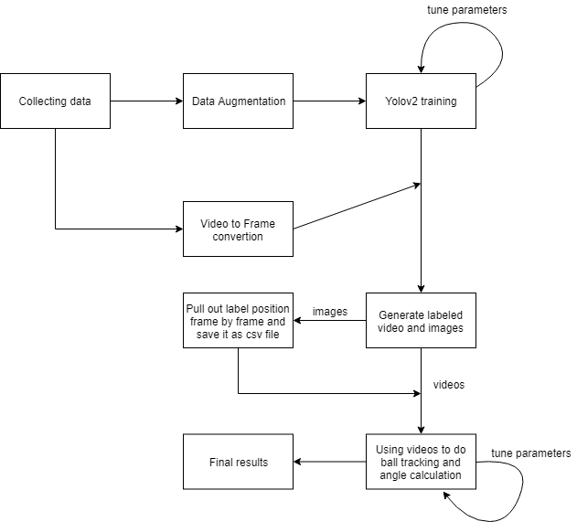
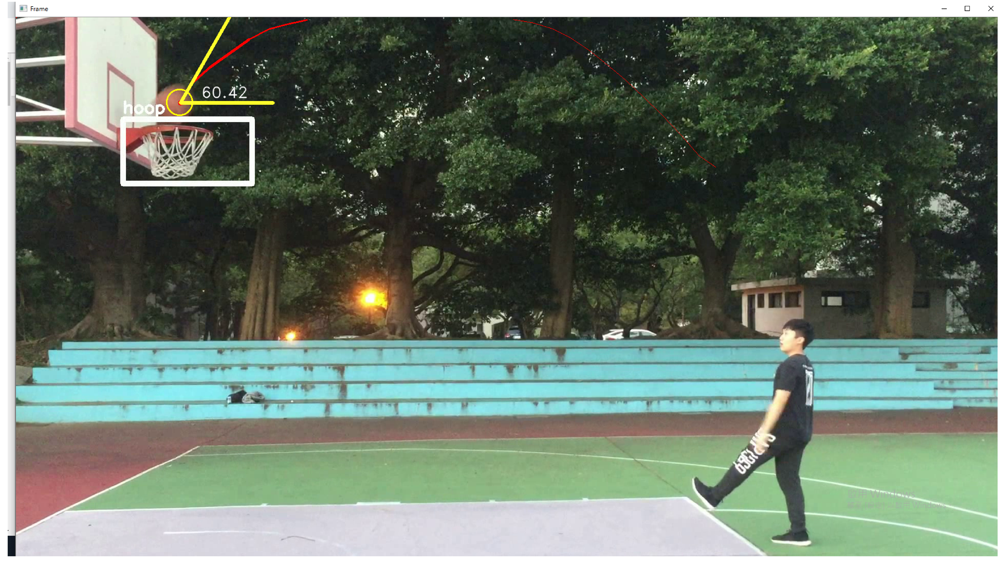
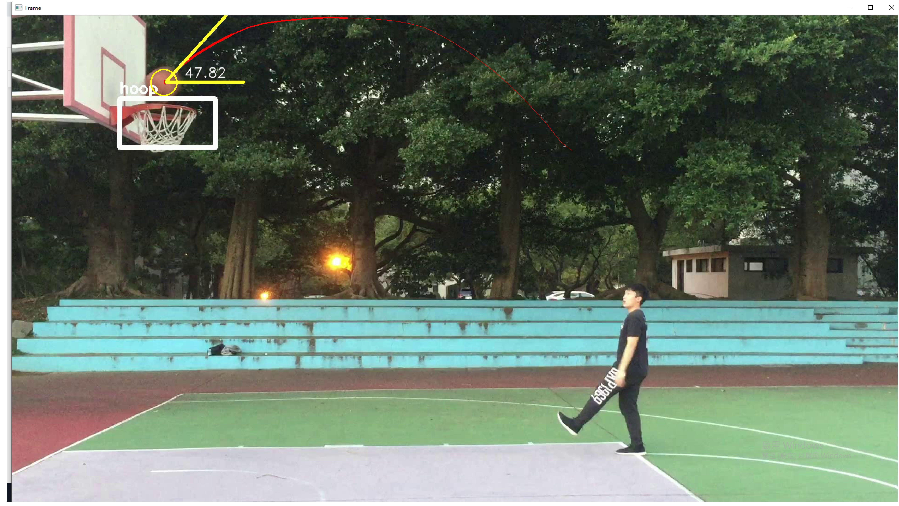
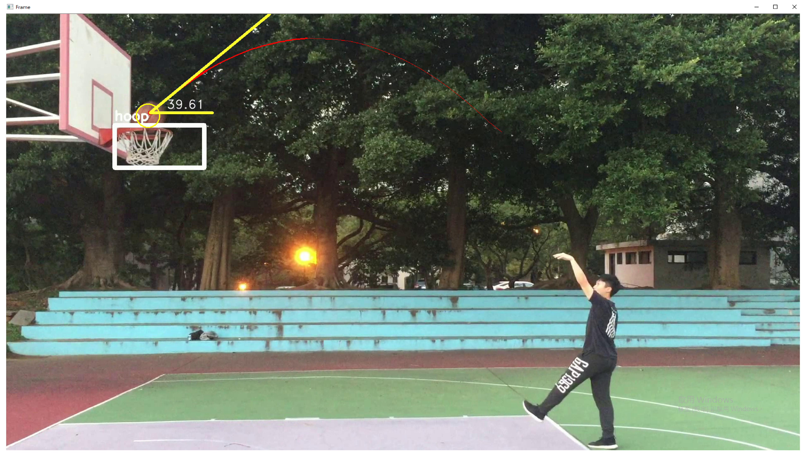
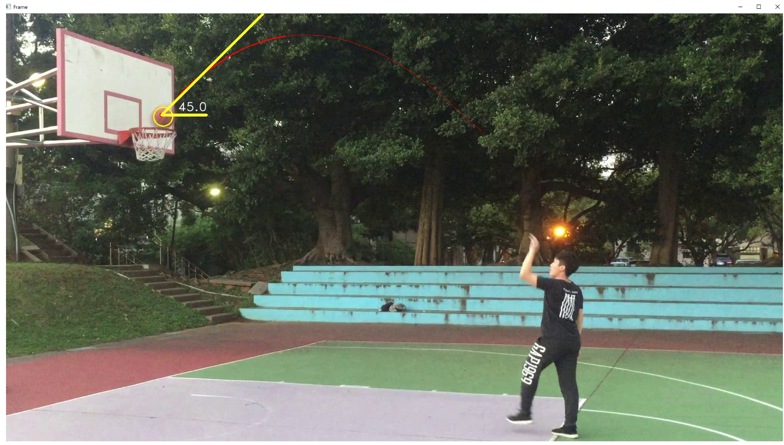
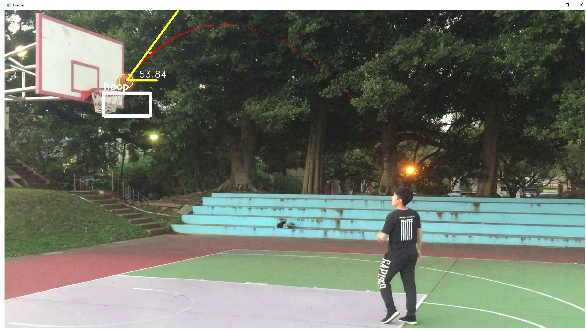
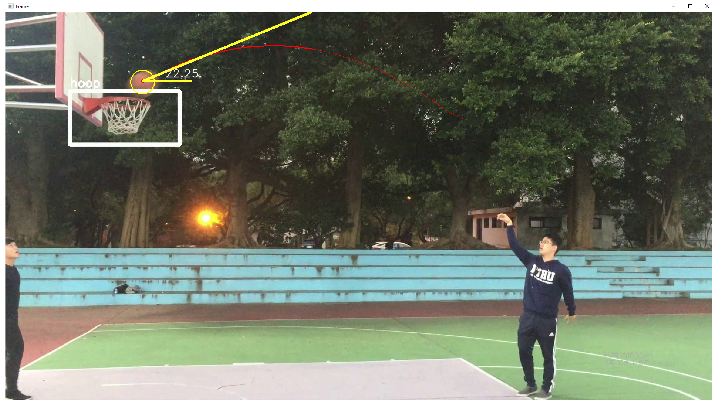
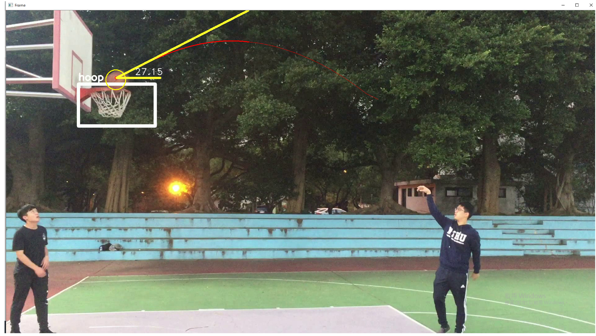

# Basketball Tracking with YOLOv2 & OpenCV
## Introduction
　　In modern life, basketball is a popular exercise, and for basketball shooting, shooting the basketball is the main purpose of this sport. 
  According to calcualtion, angle of the ball and shooting accuracy are closely connected and inseparable.
  So in this project, I aim to use some methods in deep learning to help us improve our shooting.
## Dataset
* 188 basketball hoop images
  * After data augmentation, there are total 1318 images for training
* 86 shooting videos
## Models
* Data Augmentation
  * Enlarge dataset by doing flipping, rotation, scale, translation, resize, shearing, gray scale, etc.
* labelIMG
  * label images and save it as PASCAL VOC format
* YOLOv2
  * A deep learning model that detect objects and draw bounding box around the object's position
* Ball tracking
  * Use OpenCV to track the ball and calculate the angle
## Implementation

### Training YOLOv2
　I have taken 188 pictures of basketball hoop, then do data augemtation to enlarge the dataset, finally, I have 1318 pictures for training.
Command line (under YOLO folder)
```shell
python flow --model cfg/tiny-yolo-voc-1c.cfg --load bin/tiny-yolo-voc.weights --train
--dataset ./../Hoop/images --annotation ./../Hoop/label --summary logs/ --gpu 0.6
```
or
```python
from darkflow.net.build import TFNet

video_path = './../Hoop/Data/'
for data in os.listdir(video_path):
  ### model - tiny-yolo
  ### load - official pretained weights
  ### dataset - hoop images create by my own
  ### annotation - xml files that store the label box position
  ### gpu - how many gpu we're going to use
  ### summary - tensorboard tracking event directory
  
  options = {"model": "cfg/tiny-yolo-voc-1c.cfg,
             "load": "bin/tiny-yolo-voc.weights",
             "train": True,
             "dataset": "./../Hoop/images/",
             "annotation": "./../Hoop/label",
             "gpu": 0.6,
             "summary": "logs/"}
  tfnet = TFNet(options)
```
### Turn video to frame
　Because we are going to do shooting angle calculation, we need the label position in the videos, but YOLOv2 can only output label position by giving images.
```python
for video in os.listdir(video_path):
  name = video.split('.')[0]
  frame_path = os.path.join('./../Hoop/video2frame/', name)
  
  ### create folder for individual video
  try:
    os.makedirs(frame_path)
  except OSError as e:
    if e.errno != errno.EEXIST:
      raise
      
  vidcap = cv2.VideoCapture((video_path + video))
  
  ### success means successfully reading the video
  success, frame = vidcap.read()
  count = 0
  while success:
    filename = frame_path + ('/frame_%d.png' % count)
    cv2.imwrite(filename, frame)    # save frame as PNG file
    success, frame = vidcap.read()
    if not success:
      print('Video Capture End.')
    count += 1
```
### Generate label position from frame
　After we turn video to frame, we can use these images to get bounding box position for every frame, and then store it into individual csv file for ball tracking.
Command line (under YOLO folder)
```shell
python flow --model cfg/tiny-yolo-voc-1c.cfg --load -1 imgdir ./../Hoop/video2frame --json --gpu 0.6
```
or
```python
from darkflow.net.build import TFNet

path = './../Hoop/video2frame'
fieldname = ['label', 'confidence', 'x1', 'y1', 'x2', 'y2']   # header of csv

for subdir in os.listdir(path):
  cur_folder = os.path.join(path, subdir)
  cur_csv = cur_folder + '/' + subdir + '_demo.csv'
  
  ### model - tiny-yolo we trained above
  ### load - the weights we've trained, save in checkpoint file
  
  options = {"model": cfg/tiny-yolo-voc-1c.cfg,
             "load": 7100,
             "imgdir": cur_folder,
             "json": True,
             "gpu": 0.6}
  tfnet = TFNet(options)
  
  with open(cur_csv, 'w', newline='') as csvfile:
    writer = csv.DictWriter(csvfile, fieldnames = fieldname)
    writer.writeheader()
    for frame in os.listdir(cur_folder):
      imgcv = cv2.imread(os.path.join(cur_folder, frame))
      
      ### predict label box position
      data = tfnet.retrun_predict(imgcv)
      
      file_num = len([name for name in os.listdir(cur_folder) if os.path.isfile(os.path.join(cur_folder, name))])
      for i in range(file_num - 1):
        with open((cur_folder + '/frame_%d.png' % i)) as f:
          if len(data) != 0:
            i = 0
            x = np.zeros((2, ))
            y = np.zeros((2, ))
            for val in data[0].values():
              if isinstance(val, dict):
                x[i] = val['x']
                y[i] = val['y']
                i += 1
              elif val != hoop:
                conf = val
            
            writer.writerow({"label": "hoop",
                             "confidence": float(conf),
                             "x1": float(x[0]), "y1": float(y[0]), 
                             "x2": float(x[1]), "y2": float(y[1])})
          else:
            writer.writerow({"label": "NAN",
                             "confidence": "NAN",
                             "x1": "NAN", "y1": "NAN", 
                             "x2": "NAN", "y2": "NAN"})
```
### Genrate videos with label prediction
　I've modified the original code before, in the original code, we have to feed the video by arguement after "demo", but there are lots of videos, so I write a for loop to run all videos.
Command line (under YOLO folder)
```shell
python --model cfg/tiny-yolo-voc-1c.cfg --load -1 --demo <video_filename> --saveVideo --gpu 0.6
```
or
```python
options = {"model": "cfg/tiny-yolo-voc-1c.cfg", 
           "load": 7100, 
           "demo": "video_filename"', 
           "saveVideo"': True, 
           "gpu": 0.6}
tfnet = TFNet(options)
```
P.S. Check **YOLO/darknet/help.py**'s **camera** function if code doesn't parse <video_filename> argument
### Ball tracking and shooting angle calculation
　In this part, I use the video generated by YOLO, i.e., with the label box in the video to do the work. Ball tracking detailed can be seen in ball_tracking.py.
## Result
　After all these works, there are only 7 videos that perform well, the reason is because our dataset is not big enough and ball tracking is implemented by finding upper/lower
bound of the ball color in HSV color space using OpenCV rather than deep learning technique, and this is what we need to improve in the future.







## Demo


## Future work
　I found a video on [Youtube](https://www.youtube.com/watch?v=pW6nZXeWlGM&ab_channel=ZheCao) and also its [GitHub](https://github.com/ZheC/Realtime_Multi-Person_Pose_Estimation).
This video is about realtime bonetrack of people, and can also be used in this project in the future to observe the bone of wrist to adjust shooting.
## Reference
1. https://stackoverflow.com/questions/10948589/choosing-the-correct-upper-andlower-hsv-boundaries-for-color-detection-withcv
2. http://profs.scienze.univr.it/~bloisi/tutorial/balldetection.html
3. https://www.pyimagesearch.com/2015/09/14/ball-tracking-with-opencv/
4. https://github.com/thtrieu/darkflow
5. https://medium.com/雞雞與兔兔的⼯工程世界/機器學習-ml-note-yolo-利利⽤用影像辨識做物件偵測-object-detection-的技術-3ad34a4cac70
## Folders
1. labelIMG
    * Model for label images
    * Might **not** work on **mac**
2. Data Augemtation
    * Model for enlarge our data by flip, scale, rotate, shear, resize, translate, gray scale
3. Hoop (Data folder)
    * images - images for training
    * label - PASCAL VOC format label created by labelIMG
    * Data - video data
    * video2frame - frame output from video
    * demo - YOLO output video
    * bt+yolo - final output, including hoop detection, ball tracking, and angle calculation
4. YOLO
    * YOLOv2 model with trained weights (not on GitHub, file too large)
5. convert2Yolo
    * turn PASCAL VOC format label into YOLO format, this model is **unused**
6. data.py/data_enlargement.py
    * Code for data enlargement wrote by myself, replaced by DataAugmentation, **unused**
